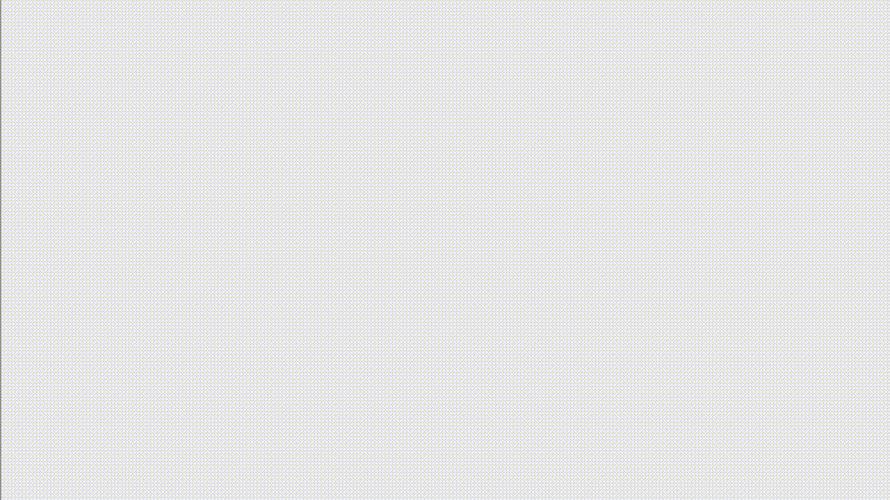

# Screensaver

Created 2016-05-13. An excerpt from Python's `turtle.py` module:

> Turtle graphics is a popular way for introducing programming to 
> __kids__. It was part of the original Logo programming language developed
> by Wally Feurzig and Seymour Papert in 1966.

